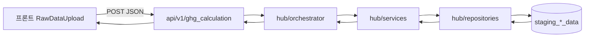

# GHG Raw Data 조회 파이프라인 — 구현 가이드

처음 보는 개발자가 **스테이징 DB → API → 프론트 표**까지 끝까지 구현할 수 있도록 정리한 문서입니다.  
이전 대화에서 합의한 설계(레이어 분리, DTO/VO 위치, EMS `raw_data` 실제 형태, 파일별 매퍼)를 모두 포함합니다.

---

## 1. 목적과 범위

### 1.1 목적

- `SDS_ESG_DATA` CSV가 적재된 **`staging_*_data` 테이블**의 `raw_data`(JSONB)를 읽어,
- 프론트 **Raw Data** 화면(예: 에너지 사용량 그리드)이 기대하는 **JSON 형태**로 변환·반환한다.
- 사용자가 필터(연도, 기간, 시설, 유형, 검색어)를 바꾼 뒤 **「조회」**를 누르면 해당 조건으로 서버에 요청한다.

### 1.2 범위

- **포함**: 스테이징 조회, `items[]` 펼치기, **소스 파일(`source_file`)별 매핑**, 연도·시설·유형·검색 필터, 에너지유형→단위 규칙, BOM 키 정규화, API·도메인 레이어 구조.
- **선택/후속**: `energy-provider`, `consignment` 등 카테고리별 세부 매퍼 추가, 인증·`company_id`를 세션에서만 주입하는 방식.

---

## 2. 전체 아키텍처

### 2.1 요청 흐름



### 2.2 레이어별 책임

| 레이어 | 경로(예시) | 책임 |
|--------|------------|------|
| API | `backend/api/v1/ghg_calculation/` | HTTP, 검증, 오류 코드, Orchestrator 호출 |
| Orchestrator | `backend/domain/v1/ghg_calculation/hub/orchestrator/` | 유스케이스 조립, DTO→서비스→응답 DTO |
| Service | `backend/domain/v1/ghg_calculation/hub/services/` | 카테고리별 로직, 파일별 매퍼 위임, 피벗·합계·필터 |
| Repository | `backend/domain/v1/ghg_calculation/hub/repositories/` | SQLAlchemy로 스테이징 행 조회 (엔티티는 `models/bases`) |
| States (DTO/VO) | `backend/domain/v1/ghg_calculation/models/states/` | 요청/응답 Pydantic 모델 |
| Enums/규칙 | `backend/domain/v1/ghg_calculation/models/enums/` | 카테고리, 스테이징 시스템, 에너지유형→단위, 카테고리→조회할 staging 시스템 목록 |
| Entities | `backend/domain/v1/ghg_calculation/models/bases/` | **테이블 정의의 단일 소스는 유지**: `data_integration`의 `Staging*` 모델을 **재노출(re-export)** 하여 중복 스키마 방지 |

---

## 3. 스테이징 `raw_data` 스키마 (반드시 이해할 것)

### 3.1 공통 형태

CSV 한 파일이 스테이징 테이블에 **한 행(row)** 으로 들어간다. `raw_data` 컬럼은 다음 형태다.

```json
{
  "items": [
    { "컬럼명1": "값", "컬럼명2": "값" }
  ],
  "source_file": "파일명.csv"
}
```

- `items`: `csv.DictReader` 결과와 동일 — **헤더가 키**가 된 dict 배열.
- `source_file`: 파일명 (매퍼 라우팅의 핵심 기준으로 사용).

적재 구현 참고: `backend/domain/v1/data_integration/hub/services/staging_ingestion_service.py` (`_csv_file_to_raw_data`).

### 3.2 EMS 예시: 재생에너지 (`EMS_RENEWABLE_ENERGY.csv`)

한 `item` 예시:

```json
{
  "year": "2024",
  "month": "1",
  "re_type": "태양광발전",
  "site_name": "수원 데이터센터",
  "\ufeffsite_code": "SITE-DC01",
  "generation_kwh": "6245.75",
  "certificate_type": "REC",
  "co2_reduction_tco2e": "2.8687"
}
```

- **시설**: `site_name` (화면의 시설명과 매핑).
- **유형**: `re_type` (재생원별 구분 — 일반 “전력/LNG” 사용량과 의미가 다를 수 있음).
- **월별 값**: `year` + `month` + `generation_kwh` 로 피벗해 1~12월 컬럼 생성.
- **단위**: 컬럼명이 `generation_kwh` 이므로 **kWh** 로 규칙 고정 가능.

### 3.3 BOM이 붙은 키 (`\ufeffsite_code`)

UTF-8 BOM 때문에 첫 헤더가 `\ufeffsite_code` 처럼 저장될 수 있다.

**필수 대응 (둘 중 하나 또는 병행)**:

1. **적재 시**: CSV 파싱 직후 모든 키에 대해 `k.lstrip("\ufeff")` 적용 후 `raw_data`에 저장. (권장 — 한 번 고치면 조회측이 단순해짐.)
2. **조회 시**: 매퍼에서 값을 읽을 때 `item.get("site_code") or item.get("\ufeffsite_code")` 또는 키 전체를 정규화하는 헬퍼 사용.

```python
def normalize_item_keys(item: dict) -> dict:
    return {str(k).lstrip("\ufeff"): v for k, v in item.items()}
```

---

## 4. 왜 `source_file` 단위 매퍼인가

같은 `staging_ems_data` 안에서도 파일마다 **컬럼(키) 세트가 다르다**.

| 파일 예시 | 특징 |
|-----------|------|
| `EMS_RENEWABLE_ENERGY.csv` | `re_type`, `generation_kwh`, `site_name`, `year`, `month` |
| `EMS_ENERGY_USAGE.csv` | (실제 헤더 확인 필요 — 전력/LNG 등 사용량일 가능성) |
| `EMS_PUREWATER_USAGE.csv` | 순수/정제수 관련 컬럼 |

따라서 **“EMS 전체를 하나의 스키마로 가정”하면 안 되고**, 아래처럼 **파일명(또는 패턴) → 전용 매퍼 함수/클래스**를 등록한다.

```text
Registry: source_file (정확 일치 또는 glob) → Mapper
```

구현 패턴 예:

- `MAPPERS: dict[str, Callable]` 에 `"EMS_RENEWABLE_ENERGY.csv"` → `map_renewable_energy_to_energy_rows(...)`.
- 알 수 없는 파일은 `items`를 로그만 남기고 건너뛰거나, `skipped_files` 를 응답 메타에 포함.

---

## 5. 카테고리 ↔ 스테이징 시스템 (조회 대상 테이블)

프론트 `RawDataCategory`와 맞춘다.

| category (API/프론트) | 조회할 스테이징 (우선순위) | 비고 |
|----------------------|---------------------------|------|
| `energy` | `ems`, (필요 시) `erp` | 에너지·재생 CSV가 EMS에 모여 있을 수 있음 |
| `waste` | `ems` | 폐기물 상세 CSV 예시 존재 |
| `pollution` | `ehs`, `ems` | 오염 측정 원본 위치에 맞게 조정 |
| `chemical` | `ehs` | 약품 등 |
| `energy-provider` | `srm`, `ems` | 초기에는 빈 배열 반환 가능 |
| `consignment` | `srm` | 초기에는 빈 배열 반환 가능 |

이 매핑은 `models/enums` 에 상수로 고정해 두고 Repository에 `systems: tuple[StagingSystemEnum, ...]` 로 넘긴다.

엔티티/테이블 이름: `staging_ems_data` 등 — ORM은 `backend/domain/v1/data_integration/models/bases/staging_tables.py` 의 `StagingEmsData` 등.

---

## 6. 에너지 사용량 UI와의 정합성

### 6.1 프론트 타입 (참고)

`frontend/src/app/(main)/ghg_calc/types/ghg.ts` 의 `EnergyData`:

- `facility`, `energyType`, `unit`, `jan` … `dec`, `total`, `source` (`if` | `manual`), `status` (`confirmed` | `draft` | `error`).

API 응답은 **camelCase** 로 맞추거나, 프론트에서 snake_case를 받도록 통일한다. (한쪽으로만 고정.)

### 6.2 일반 전력·LNG 등: 유형 → 단위 규칙

원본에 `단위` 컬럼이 없을 때 **규칙 테이블**로 채운다 (LLM 불필요).

| 에너지유형(표시 문자열) | 단위 |
|-------------------------|------|
| 전력 | kWh |
| LNG | Nm³ |
| 열·스팀 | Gcal |
| 용수 | m³ |
| 순수 / 순수(정제수) | m³ |

필터 UI의 `순수(정제수)` 와 원본 `순수` 불일치는 **별칭(alias)** 으로 처리한다.

### 6.3 재생에너지 파일과 “에너지 사용량” 탭

`EMS_RENEWABLE_ENERGY` 는 **발전량(kWh)** 이므로, 제품 정책에 따라:

- **같은 표에 표시**: `energyType` 에 `re_type` 그대로 또는 `전력(재생)` 등 접두 규칙, `unit` = `kWh`.
- **분리**: 별도 서브타입/탭/필터로만 보이게 함.

문서화만으로는 정책을 강제할 수 없으므로, **Enum 또는 설정 플래그**로 “재생 파일을 energy 그리드에 포함할지”를 명시해 둔다.

---

## 7. DTO / VO ( `models/states` )

### 7.1 요청 DTO: `RawDataInquiryRequestDto`

| 필드 | 타입 | 설명 |
|------|------|------|
| `company_id` | UUID | `companies.id` — 스테이징 행 필터 |
| `category` | 문자열 enum | `energy` \| `waste` \| `pollution` \| `chemical` \| `energy-provider` \| `consignment` |
| `year` | string | 예: `"2026"` — `item["year"]` 과 문자열 비교 통일 권장 |
| `period_type` | string | UI 라벨 보존용, 예: `"월"` |
| `facility` | string | `"전체"` 이면 시설 필터 생략 |
| `sub_type` | string | 에너지 탭의 “유형” 드롭다운 값, `"전체"` 이면 생략 |
| `search_keyword` | string | 시설명·유형 등 부분 검색 (소문자/공백 trim) |

(로그인 후 세션에서만 `company_id` 를 쓰도록 바꿀 경우, API 레이어에서 주입하고 body에서는 제외해도 된다.)

### 7.2 응답 VO: 에너지 행 `EnergyUsageRowVo`

프론트 `EnergyData` 에 맞춘 필드명으로 정의한다.

- `id`: 정수 — 스테이징 PK가 아니라 **표시용**이면 누적 카운터 또는 해시 기반 int.
- `energyType`, `source`, `status` 등은 JSON 직렬화 시 camelCase (`serialization_alias` 등) 권장.

### 7.3 응답 래퍼: `RawDataInquiryResponseDto`

- `category`, `year`
- `energy_rows: list[EnergyUsageRowVo]` (에너지 카테고리일 때만 채움)
- 추후 `waste_rows`, `pollution_rows` … 동일 패턴으로 확장.

---

## 8. Repository 구현 요약

### 8.1 책임

- `company_id` + `systems` (예: `("ems",)`) 에 대해 각 스테이징 모델을 조회.
- 반환 타입은 **도메인 전용 스냅샷** 권장 (ORM 세션 밖에서도 안전하게 쓰기 위해):

```python
@dataclass
class StagingRawRowSnapshot:
    staging_system: str          # "ems"
    staging_id: UUID
    source_file_name: str | None
    raw_data: dict
    import_status: str | None
```

### 8.2 세션

`backend/domain/v1/data_integration/hub/repositories/staging_repository.py` 와 동일하게 `get_session()` 사용, **본인이 연 세션은 finally에서 close**.

---

## 9. Service 구현 단계 (에너지 카테고리)

1. **조회**: Repository로 `StagingRawRowSnapshot` 목록 획득.
2. **펼치기**: 각 스냅샷의 `raw_data.get("items") or []` 를 순회.
3. **라우팅**: `source_file_name` 또는 `raw_data["source_file"]` 로 매퍼 선택.
4. **정규화**: 각 item에 `normalize_item_keys` 적용.
5. **연도 필터**: `year` 요청값과 item의 `year` 비교 (문자열 통일).
6. **피벗**: `(시설 키, 유형 키)` 로 그룹 — 예: `(site_name, re_type)` → 월 인덱스별 `generation_kwh` 합산/대입.
7. **시설/유형/검색 필터**: `facility`, `sub_type`, `search_keyword` 적용 (별칭 테이블 활용).
8. **단위**: 파일/유형별 규칙 (재생 → kWh, 일반 전력 → 규칙 테이블).
9. **상태/입력방식**: 스테이징 `import_status` → `completed` → `confirmed` + `source=if` 등 규칙 표로 매핑 (임시저장은 별도 비즈니스 테이블이 생기면 그때 확장).
10. **VO 빌드**: 월 값 포맷(천 단위 콤마는 프론트/백 중 한 곳에서만 통일), `total` 계산.

---

## 10. Orchestrator

- 입력: `RawDataInquiryRequestDto`
- `category` 에 따라 적절한 Service 메서드 호출 (초기에는 `energy` 만 구현해도 됨).
- 출력: `RawDataInquiryResponseDto`
- 트랜잭션: 조회만이면 읽기 전용 세션으로 충분.

---

## 11. API ( `backend/api/v1/ghg_calculation` )

### 11.1 라우터 등록

- `APIRouter(prefix="/ghg-calculation", tags=["GHG Calculation"])`
- 하위에 예: `POST /raw-data/inquiry`
- 루트 앱 `backend/api/v1/main.py` 에 `include_router(ghg_calculation_router)` 추가.

### 11.2 엔드포인트 예시

- **Method/Path**: `POST /ghg-calculation/raw-data/inquiry`
- **Body**: `RawDataInquiryRequestDto`
- **Response**: `RawDataInquiryResponseDto`
- **Errors**: `400` 검증 실패, `500` 예외 (내부 로그에 스택).

---

## 12. 프론트 연동 (`RawDataUpload.tsx`)

### 12.0 환경 변수 (Next.js)

`frontend/.env.local` 예시:

```env
NEXT_PUBLIC_GHG_API_BASE=http://127.0.0.1:9001
NEXT_PUBLIC_GHG_COMPANY_ID=00000000-0000-0000-0000-000000000000
```

`NEXT_PUBLIC_GHG_COMPANY_ID` 는 스테이징 데이터를 적재할 때 사용한 `companies.id`(UUID)와 동일해야 조회됩니다.

백엔드 `backend/api/v1/main.py` 에는 로컬 프론트용 `CORS_ORIGINS` 기본값이 포함되어 있습니다. 필요 시 환경 변수 `CORS_ORIGINS` 로 수정합니다.

---

## 12.1 프론트 연동 (`RawDataUpload.tsx`) — 상세

### 12.1 위치

- 페이지: `frontend/src/app/(main)/ghg_calc/page.tsx` — 단일 라우트 `/ghg_calc` 에서 탭/카테고리 상태로 전환.
- 에너지 표: `components/raw-data/RawDataUpload.tsx`, `category === "energy"` 일 때 `EnergyTable`.

### 12.2 조회 버튼

현재 UI의 **「조회」** 버튼에 `onClick` (또는 form submit) 을 연결한다.

- 상태: `selectedYear`, `periodType`, `selectedFacility`, `energyTypeFilter`, `searchKeyword`, 상위에서 내려준 `category` 및 `companyId`(또는 세션).
- `fetch(API_BASE + "/ghg-calculation/raw-data/inquiry", { method: "POST", headers: { "Content-Type": "application/json", ... }, body: JSON.stringify({...}) })`
- 응답의 `energyRows`(camelCase) 로 로컬 state 갱신 후 테이블 재렌더.

### 12.3 CORS·Base URL

개발 시 Next.js와 API 포트가 다르면 CORS 또는 rewrites 설정 필요.

---

## 13. `EMS_RENEWABLE_ENERGY` → `EnergyUsageRowVo` 의사코드

입력: `items` (정규화 후), 요청 `year`, 필터들.

```python
from collections import defaultdict

def pivot_renewable(items, year: str):
    # key -> list of 12 floats (or None)
    buckets = defaultdict(lambda: [None] * 12)
    for it in items:
        if str(it.get("year", "")).strip() != str(year).strip():
            continue
        site = it.get("site_name") or ""
        etype = it.get("re_type") or ""
        m = int(str(it.get("month", "0")).strip() or 0)
        if not (1 <= m <= 12):
            continue
        val = float(str(it.get("generation_kwh", "0")).replace(",", "") or 0)
        key = (site, etype)
        prev = buckets[key][m - 1]
        buckets[key][m - 1] = (prev or 0) + val
    rows = []
    for i, ((site, etype), months) in enumerate(buckets.items(), start=1):
        total = sum(x for x in months if x is not None)
        rows.append({
            "id": i,
            "facility": site,
            "energyType": etype,
            "unit": "kWh",
            # format_month_cell: 정수면 콤마, 소수면 적절한 자릿수
            "jan": format_cell(months[0]),
            # ... dec
            "total": format_cell(total),
            "source": "if",
            "status": "confirmed",
        })
    return rows
```

이후 **시설/유형/검색 필터**를 `rows` 리스트에 적용하면 된다.

---

## 14. 구현 체크리스트

- [ ] `models/enums`: `RawDataCategoryEnum`, `StagingSystemEnum`, `STAGING_SYSTEMS_BY_CATEGORY`, `ENERGY_TYPE_TO_UNIT`, 별칭
- [ ] `models/states`: `RawDataInquiryRequestDto`, `EnergyUsageRowVo`, `RawDataInquiryResponseDto`
- [ ] `models/bases`: `Staging*` 및 `STAGING_MODEL_MAP` 재노출
- [ ] `hub/repositories/staging_raw_repository.py`: `list_by_company_and_systems`
- [ ] `hub/services/raw_data_inquiry_service.py`: 에너지 파이프라인 + 매퍼 레지스트리
- [ ] `hub/mappers/` (선택): `renewable_energy.py`, `energy_usage.py` 파일 분리
- [ ] `hub/orchestrator/raw_data_inquiry_orchestrator.py`
- [ ] `api/v1/ghg_calculation/routes.py` + `main.py` include_router
- [ ] CSV 적재 시 **BOM 키 제거** (`staging_ingestion_service.py`)
- [ ] 프론트: 조회 버튼 + API 호출 + state 연동
- [ ] 통합 테스트: fixture `raw_data` JSON으로 Service 단위 테스트

---

## 15. 참고 파일 (레포 내)

| 내용 | 경로 |
|------|------|
| 스테이징 적재 형식 | `backend/domain/v1/data_integration/hub/services/staging_ingestion_service.py` |
| 스테이징 저장소 예시 | `backend/domain/v1/data_integration/hub/repositories/staging_repository.py` |
| 스테이징 ORM | `backend/domain/v1/data_integration/models/bases/staging_tables.py` |
| 스테이징 ingest API | `backend/api/v1/data_integration/staging_router.py` |
| 프론트 타입 | `frontend/src/app/(main)/ghg_calc/types/ghg.ts` |
| Raw Data UI | `frontend/src/app/(main)/ghg_calc/components/raw-data/RawDataUpload.tsx` |
| 문서 DB 스테이징 설명 | `backend/domain/v1/ifrs_agent/docs/DATABASE_TABLES_STRUCTURE.md` (섹션 6 스테이징) |

---

이 문서만으로 디렉터리 생성·클래스 스켈레톤·첫 매퍼(`EMS_RENEWABLE_ENERGY`)·API 한 개까지 연결할 수 있도록 작성하였다. 파일별 세부 시그니처는 레포 스타일(import 경로, `get_session` 위치)에 맞춰 조정하면 된다.
